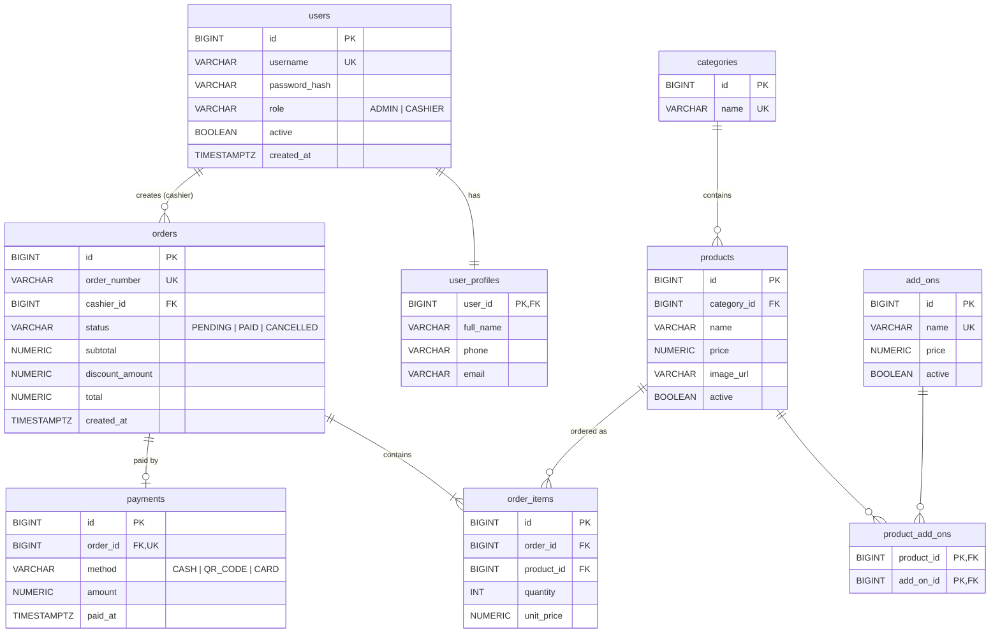

# ER Diagram — Cafe POS

Source of truth: `code/backend/src/main/resources/db/migration/V1__init_schema.sql`

## Relationships

| ประเภท | ตาราง | Cardinality | JPA Mapping | Fetch / Cascade | เหตุผล |
| ------ | ----- | ----------- | ----------- | --------------- | ------ |
| One-to-One | `users` — `user_profiles` | 1 : 1 | `UserProfile.user` `@OneToOne @MapsId` | LAZY / DB `ON DELETE CASCADE` | Shared PK — profile ไม่มีความหมายถ้าไม่มี user |
| One-to-One | `orders` — `payments` | 1 : 0..1 | `Payment.order` `@OneToOne` (`order_id` UNIQUE) | LAZY / ไม่มี cascade | ออเดอร์ที่ยัง PENDING ยังไม่มี payment, จ่ายได้ครั้งเดียว |
| One-to-Many | `categories` → `products` | 1 : N | `Product.category` `@ManyToOne` | LAZY / ไม่มี cascade | ลบหมวดที่ยังมีสินค้าไม่ได้ (FK RESTRICT) |
| One-to-Many | `users` → `orders` | 1 : N | `Order.cashier` `@ManyToOne` | LAZY / ไม่มี cascade | เก็บว่าใครเปิดบิล, ลบ user ที่มีบิลไม่ได้ |
| One-to-Many | `orders` → `order_items` | 1 : 1..N | `Order.items` `@OneToMany(mappedBy)` ↔ `OrderItem.order` | LAZY / `CascadeType.ALL` + `orphanRemoval` | รายการในบิลเกิดและตายพร้อมออเดอร์ |
| One-to-Many | `products` → `order_items` | 1 : N | `OrderItem.product` `@ManyToOne` | LAZY / ไม่มี cascade | สินค้าที่เคยขายห้ามลบจริง (ใช้ `active=false`) |
| Many-to-Many | `products` — `add_ons` | M : N | `Product.addOns` `@ManyToMany @JoinTable` | LAZY (default) / ไม่มี cascade | add-on จัดการแยก, ตาราง join ไม่มีข้อมูลเพิ่ม |
